# Web UI

The web UI (`cmd/web`) is a browser-based alternative to `tapectl` for day-to-day
operation: submitting backup runs (including dry-runs), watching a run progress live,
acting on an operator-in-the-loop pause, and browsing run history — with no local
`tapectl` install or Temporal CLI access required. It talks only to the
Temporal frontend and the configured OIDC identity provider; it never touches tape
hardware or bulk data directly (SPEC §2, §4.2 — there is no UI-owned state, only Temporal
visibility and the backup workflow's own queries).

This doc covers day-to-day *use* of the UI. For deploying it, see
[`docs/web-image.md`](web-image.md) (the OCI image) and
[`docs/web-helm.md`](web-helm.md) (the Helm chart); for the full set of environment
variables and the OIDC login-flow internals, see
[Web UI environment variables](configuration.md#web-ui-environment-variables-cmdweb) and
[OIDC authentication](configuration.md#oidc-authentication-cmdweb) in
`docs/configuration.md`. For the design rationale behind the UI (why it exists, its
architecture, and the delivery plan for the epic that built it), see
[`docs/web-ui-design.md`](web-ui-design.md) — that is a design doc for implementers and
reviewers, not this operator guide.

Everything the UI does, `tapectl` can also do from the command line
([`docs/tapectl.md`](tapectl.md)) — the two share the same submit/dry-run path
(`pkg/runsubmit`) and the same resume/abort signals, so they can never diverge on what an
action means. Use whichever is more convenient.

## Reaching the UI

Open the URL your deployment's Ingress (or `Service`, for a port-forward/internal-only
setup) exposes for the `tape-archiver-web` chart release — see
[`docs/web-helm.md`](web-helm.md) for how that's configured. All data requires a
signed-in session; visiting any URL while unauthenticated shows the UI's own login page,
whose single **Continue with SSO** control hands you to the configured OIDC identity
provider to sign in, then returns you to wherever you were headed. There is no separate
"public" view, and no username/password form of its own — credentials are always entered
at the identity provider, never in this UI.

The login page also reports sign-in problems rather than leaving you on a provider error
page: **Access denied** when the identity provider refused the sign-in (for example your
account is not assigned to this application), and **Session expired** when a login
attempt went stale or your previous session timed out — both with a control to retry (or
try a different account). When the provider includes a reason with its denial, that
message is shown too, attributed to the identity provider (e.g. "Identity provider: User
not assigned to application"), so you can tell a policy/assignment denial apart from a
malformed request without digging through server logs. That text comes straight from the
provider and is sanitized before display.

Session expiry mid-use is handled the same way: if your session ends while a tab is
open (for example past the server's `maxSessionDuration`), the next thing the app
fetches — a page's data load, an action like resume/abort, or the live run event
stream reconnecting — detects it and returns you to the login page, remembering the
page you were on; signing back in lands you there again. Only a genuine
session-is-gone response from the server triggers this — a transient network problem
(server briefly unreachable, a dropped connection) instead shows in place as each
page's own error or connection state, without ending your session.

The app shell — a persistent left sidebar with the `tape-archiver` brand,
**Dashboard** / **Start new run** / **Tapes** navigation, a **Light/Dark/Auto** theme
control, your signed-in name/email, and a build-version footer — is present on every
page and reachable from anywhere in the UI. **Dashboard** (`/`) is the UI's home page —
see [Dashboard](#dashboard) below. While a run is in progress, **Start new run** is
disabled (with an explanation on hover) since backup runs are a singleton (SPEC §4.2) —
finish or abort the current run first. **Tapes** (`/tapes`) is the history-derived tape
listing — see [Browsing tapes](#browsing-tapes) below. The footer shows the deployed
build's version and, when the deployment sets `WEB_FOOTER_HOST`
([configuration.md](configuration.md#web-ui-environment-variables-cmdweb)), a
deploy-specific label after it; with the variable unset the label is simply absent.

The theme control switches immediately and remembers your choice (stored in the
browser, per-browser — not an account-wide setting) across visits; **Auto** (the
default) follows your OS/browser's light/dark preference, including live changes
mid-session.

Navigating to a URL that doesn't exist (a mistyped path, a stale bookmark) shows a
404 page inside the same shell, with a way back to the dashboard — never a blank page:

| Light | Dark |
| --- | --- |
| 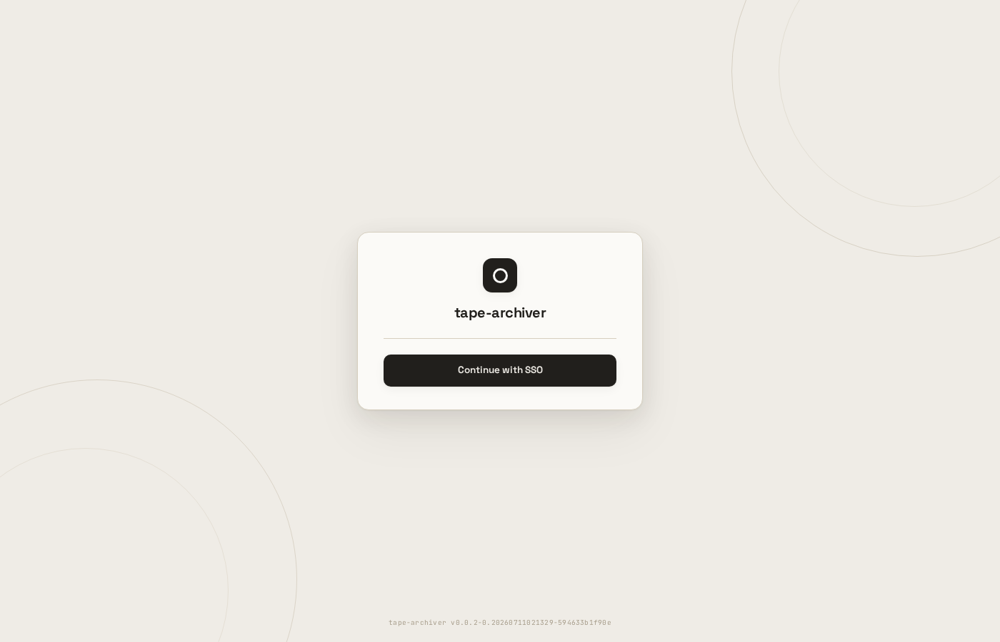 | 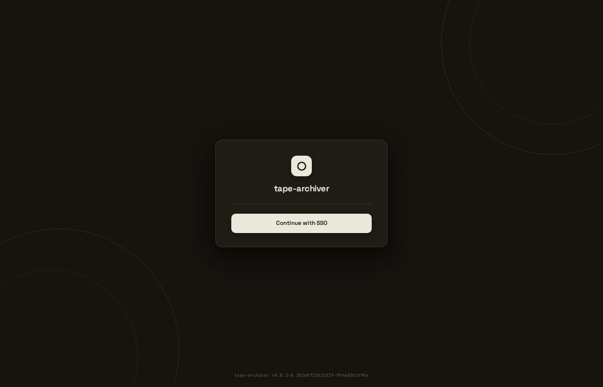 |
| 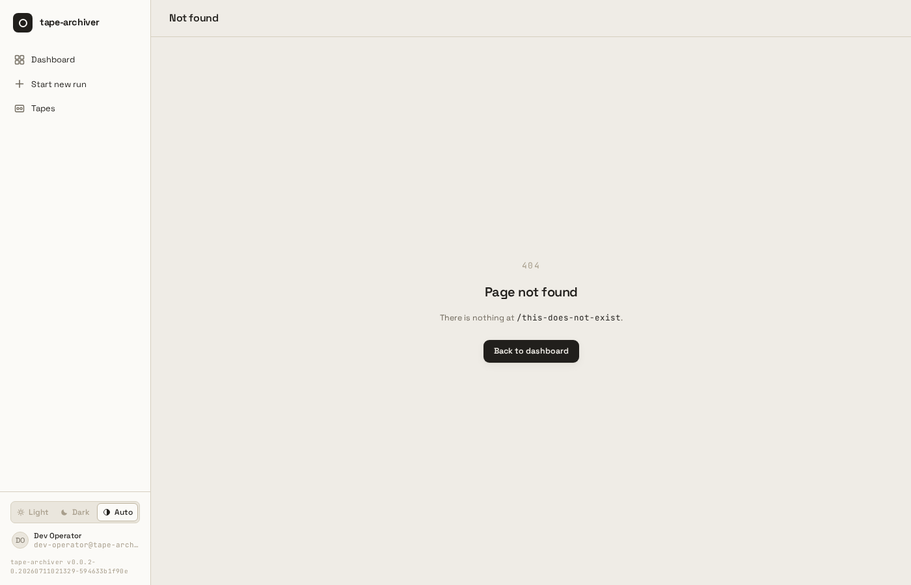 | 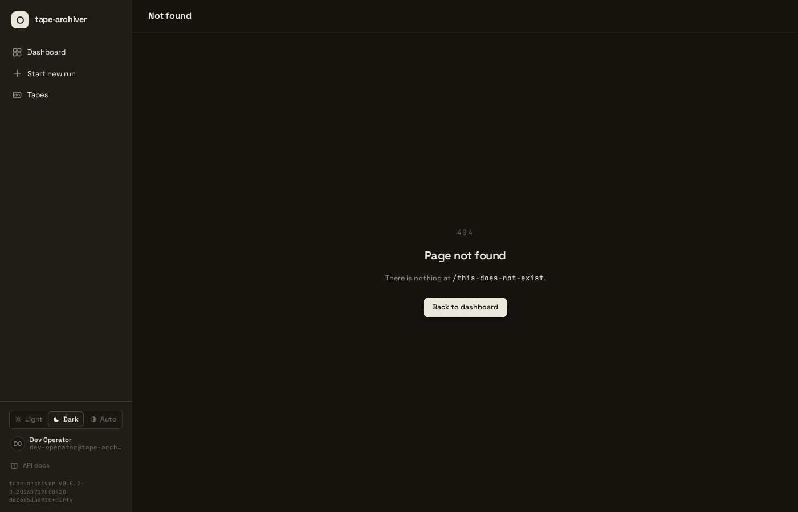 |

## Dashboard

The dashboard (`/` — the sidebar's **Dashboard** item, and the UI's home page) is the
first thing you see after signing in: a **current run** card, the run history table,
a **library** summary, and a **hardware & environment** card. `/history` — the old
standalone history page — now redirects here; run history lives only as the table
embedded in this page.

The current-run card is one of three mutually exclusive states:

- **Active** — a run is in progress: its status, last completed phase, and pipeline
  progress, updating live (the same server-sent event stream [Monitoring a run
  live](#monitoring-a-run-live) describes), with an **Open run →** link into its full
  detail page.
- **Paused** — the in-progress run is waiting on an operator action: the same narrative
  and **Resume**/**Abort** controls described in [Acting on an operator-in-the-loop
  pause](#acting-on-an-operator-in-the-loop-pause), surfaced right on the dashboard so
  you don't have to open the run to see it needs you.
- **Idle** — no run is currently active: a summary of the most recently completed run
  (or, before any run has ever been submitted, a first-run empty state), with a
  **Start a run →** link.

Below it, the **runs** table lists every execution of the singleton backup workflow
within Temporal's visibility retention window — the same executions `temporal workflow
list` (or the Temporal Web UI) would show against workflow ID `backup`, and the same
run/status/timing history `/history` used to show standalone — eight at a time, with
**Prev**/**Next** pagination. `tapectl status` only reports the *current* run (SPEC
§4.2's singleton model) and has no history equivalent — this table is the only place
status/timing for *past* runs is surfaced without going to Temporal directly. Click a
run's ID to open its [detail page](#monitoring-a-run-live). A closed run's "last
completed phase" column reads "—": only a live workflow query can answer that, and a
closed run has no worker left polling it — its final status and timing tell you how it
ended; a run's PDF report (delivered to Discord on completion, see
[`docs/report.md`](report.md)) has the full phase-by-phase detail if you need it.

The **library** card is explicitly *not* a live view of the changer/drives — no live
SCSI element-status source exists yet (epic #271 descopes it deliberately) — and says so.
What it shows instead is a small summary (tapes written/failed/in-progress) derived from
recent run history (the same `GET /api/tapes` endpoint behind the [Tapes
page](#browsing-tapes)), clearly labeled as history-derived rather than the library's
current physical state.

The **hardware & environment** card describes the deployment's fixed environment, read
from the deploy-config endpoint (`GET /api/config/ui`) rather than any one run's
submitted config: the changer/drive/burner device paths, the delivery webhook
(configured or not — the value itself is never shown, since a Discord webhook URL is a
credential), the physical library topology (storage-slot count, cleaning and
I/O-station slots), and the Temporal UI base URL and namespace. Sourcing it from deploy
config means it is correct before the first run is ever submitted, and it never reflects
the mhvtl virtual devices a dry-run substitutes for the real changer/drives. A value the
deployment hasn't set simply has no row, rather than a blank or placeholder one (the
webhook is the exception — it always shows *configured* or *not configured*). The
per-run encryption recipient is deliberately not shown here: it has no deploy-config
source and is a run-detail concern, not part of the fixed environment.

| Light | Dark |
| --- | --- |
| 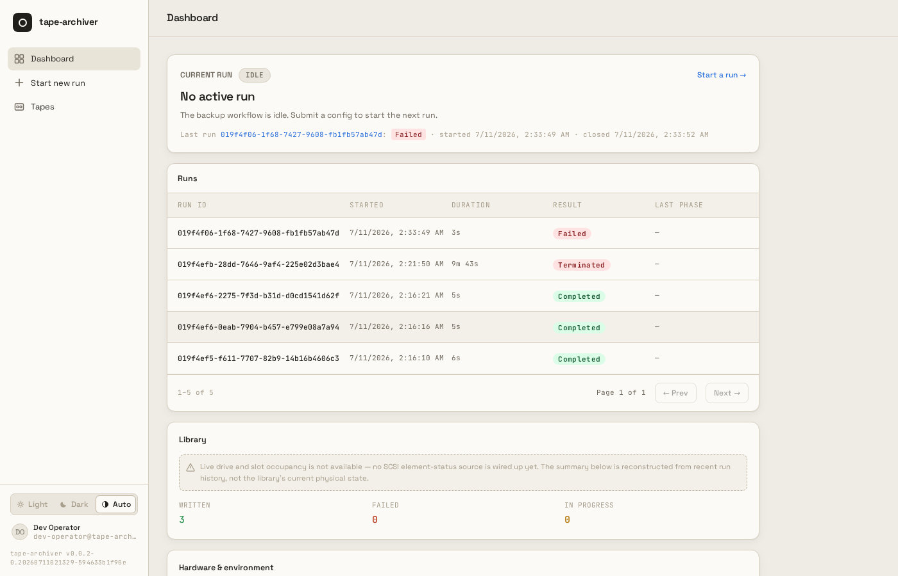 | 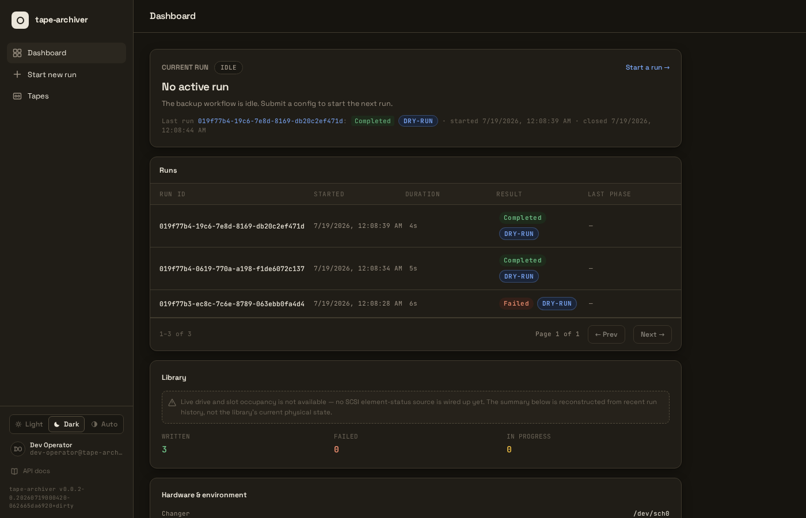 |

## Starting a new run (the config page)

The config page (`/submit` — the sidebar's **Start new run** item) builds and submits
a run config in either of two modes, switched by the **Form / Paste-upload** toggle at
the top. Both modes take the same two steps — a **Review →** button that shows exactly
what will be submitted, then a **Submit run** button on that Review step that actually
submits — so neither mode submits straight from its editor, and both end in the same
submission the CLI makes (`POST /api/runs`, the exact path `tapectl run [--dry-run]`
uses). Where they differ is validation: Form mode checks the assembled config against
the committed run-config JSON Schema ([`schemas/run-config.schema.json`](configuration.md),
served by `GET /api/config/schema`) before it will advance to Review, while JSON / paste
mode leaves validation to the server (its escape-hatch role — see below).

If a run is already in progress when the page opens, it shows a blocked state — "A run
is already in progress", with an **Open current run** link — instead of the editor:
backup runs are a singleton (SPEC §4.2), so a submission could only fail anyway. (The
server still independently rejects a conflicting submission with a conflict error, so
nothing depends on the page-level check.)

### Form mode

A guided, sectioned builder covering the whole config surface an operator normally
needs (see [`docs/configuration.md`](configuration.md) for what every field means):

- **Sources** — repeatable cards, each either a raw **ZFS** dataset/snapshot name or a
  **k8s** snapshot resource (`VolumeSnapshot` / `VolumeGroupSnapshot`, selected by
  namespace+name or by label selector — the matching `apiVersion` is filled in for
  you), with a per-source zstd compression toggle and an optional label.
- **Copies & redundancy** — tape copy count, slice size, and the PAR2 policy (fixed
  target percentage, or fill-to-capacity with a floor).
- **Library** — the changer device and drive device list, shown **read-only** from
  deploy config (these are host properties, not per-run choices — see below); the
  tape generation (the capacity `select` lists LTO-6 2.5 TB through LTO-9 18 TB
  native capacities); a **slot-grid picker** for the run's blank/write-target
  storage slots, bounded to the deployment's real library topology from deploy
  config (slot count, with cleaning and I/O-station slots rendered non-selectable —
  see below), so an operator only ever clicks real, loadable slots rather than
  typing arbitrary numbers; and the deliberately guarded "allow non-blank tapes"
  opt-out.
- **Encryption** — the age recipient list and escrowed identity, plus a
  **Generate new age keypair** button: it calls the server's
  [`POST /api/age/keygen`](configuration.md#post-apiagekeygen-age-keypair-generation-issue-279)
  endpoint, inserts the new public recipient into the config, fills the identity
  field, and shows the private identity **exactly once** with a copy control. There is
  no way to retrieve it again from the app afterward — not after a reload, not after
  generating another pair; the server never persists or logs it. (It is not lost
  outright, though: a completed run escrows the identity into its report and recovery
  ISO — SPEC §7 — which is why the panel carries no "save it now or lose it forever"
  warning.)
- **Delivery** — the Discord webhook URL, shown **read-only** from deploy config
  (see below), and the optional optical recovery-disc burning section: an on/off
  toggle, the copies per run, and the rewritable-disc reclaim opt-out, plus the
  burner device paths shown **read-only** from deploy config (see below).

**Deploy-owned fields (changer, drives, Discord webhook).** The library changer/drive
device paths and the Discord webhook URL are properties of the deployment/host, not
per-run choices, so Form mode has **no field for them at all** — not even a read-only
display. They come from the deployment's own config
(`LIBRARY_CHANGER` / `LIBRARY_DRIVES` / `DELIVERY_WEBHOOK_URL` on `cmd/web`, surfaced by
`GET /api/config/ui` — see
[Web UI environment variables](configuration.md#web-ui-environment-variables-cmdweb)),
and are filled into the submitted run config so it still carries them. This is also
enforced on the server: `cmd/web` overwrites any configured changer/drive/webhook onto
**every** submitted run config before the run starts, so no submission path — Form mode,
JSON / paste mode, or a direct `POST /api/runs` — can target a device or webhook the host
does not own. For a field a deployment has not configured, Form mode has no control to
fill it, so a Form-mode run leaves it empty and the Review step reports the matching
validation error rather than the UI inventing a default; only that unset field can be
supplied per run
via JSON / paste mode.

**Deploy-owned optical burner drives.** The optical burner device paths are a
deployment property too (`OPTICAL_BURNER_DRIVES` on `cmd/web`, surfaced by the same
`GET /api/config/ui`), so the operator does not type them — Form mode sources them from
deploy config. Unlike the changer/drive devices above, though, they **are** shown
(read-only) in the Delivery section's optical-burn subsection when the operator enables
burning, so the operator can see which devices a burn will target while still controlling
only the on/off toggle and the copies per run. The server enforces them the same way as
the other deploy-owned fields, but only when a submitted run actually enables optical
burn (carries a `delivery.opticalBurn` block): a burn-off run never gains a spurious one.
When the deployment configured no burner drives, the subsection shows a "not configured"
notice naming the env var to set; JSON / paste mode remains the escape hatch.

**Deploy-owned library topology (slot-grid picker).** The physical library's slot
layout is likewise a deployment property, so the Library section's blank/write-target
**slot picker** is a grid bounded to that layout rather than a free-form list of numbers.
It comes from `LIBRARY_SLOT_COUNT` (the storage slot count, numbered `1..N`) plus
`LIBRARY_CLEANING_SLOTS` / `LIBRARY_IO_STATION_SLOTS` (slot numbers reserved for cleaning
cartridges and the I/O station), all on `cmd/web` and surfaced by the same
`GET /api/config/ui`. Reserved slots are rendered non-selectable, so a run can only target
real, loadable storage slots; the picker adapts to any library size purely from the config
value, with no frontend change. The per-run **selection** of which blanks a run uses
(`library.blankSlots`) is still made in the form — the topology only bounds it. A
deployment that declared no topology (`LIBRARY_SLOT_COUNT` unset) shows the picker as "not
configured"; set the blank slots via JSON / paste mode in that case. This is *static*
topology only — it does not show live per-slot occupancy (which barcode sits in which slot
right now), which would need live changer element-status on the storage host.

A few advanced tuning fields (`feasibilityOverhead` and the operator-wait timeout
overrides) have no form controls; use JSON mode for those — the run gets their
documented defaults otherwise.

Pressing **Review →** validates the assembled config against the schema. Any problem
blocks the transition and is listed by field path (e.g.
`encryption.identity: is required`); a valid config advances to the **Review** step,
which shows a summary (mode, sources, copies, redundancy, encryption, recovery discs),
a note that blank-tape checking happens at write time, and the final run-config JSON
exactly as it will be submitted. Submit from there, or go **← Back to edit**.

| Light | Dark |
| --- | --- |
| 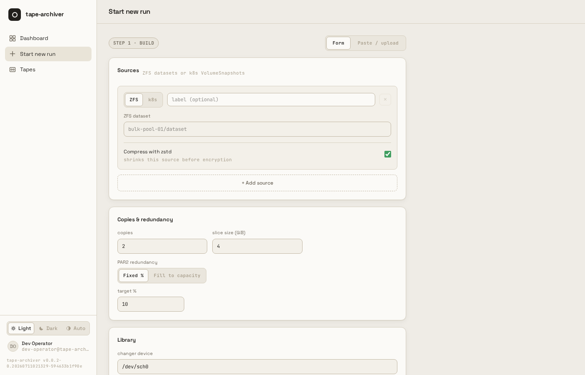 | 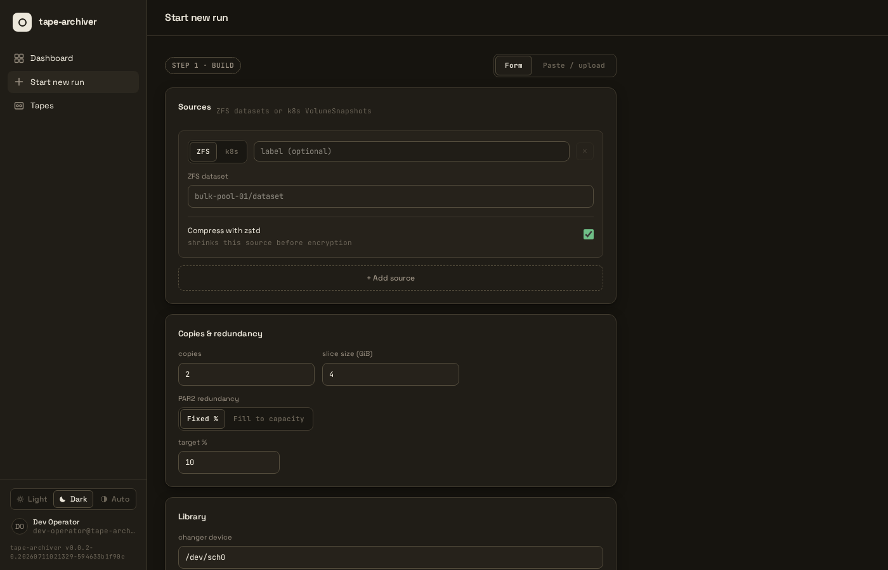 |
| 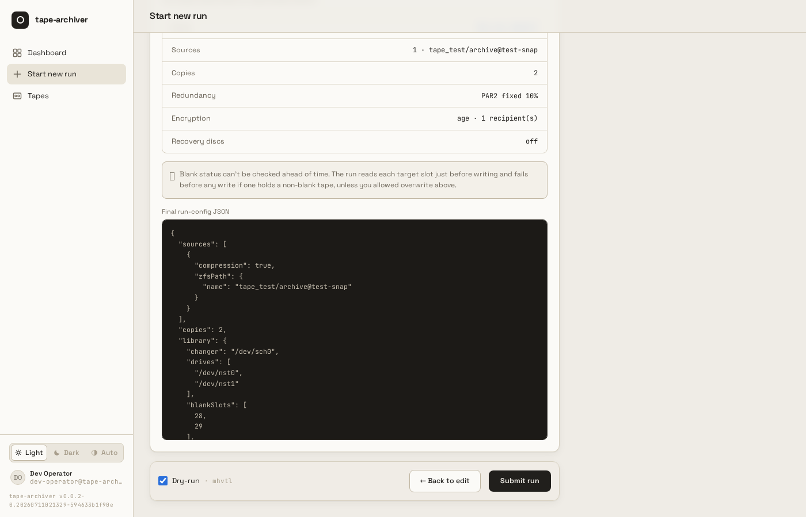 | 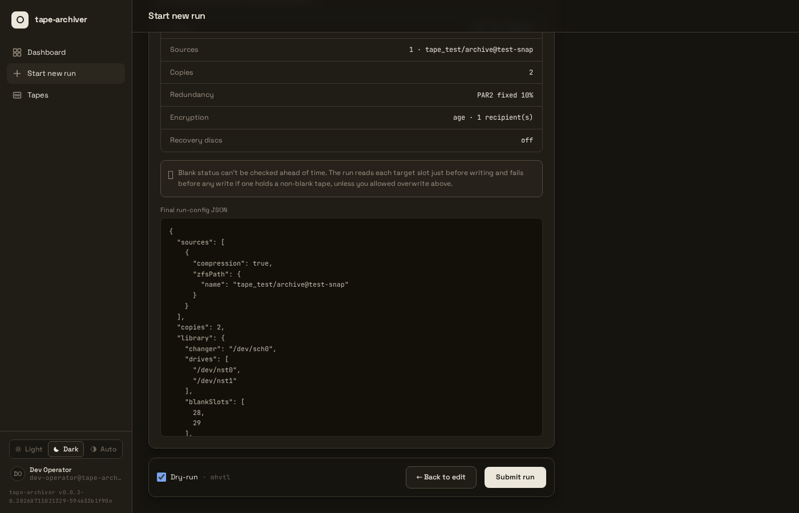 |

### JSON mode (paste / upload)

Paste a run-config JSON document into the text area or load one from disk with the file
picker (read client-side — nothing is uploaded until you submit). Pressing **Review →**
parses the text and, if it is valid JSON, advances to the same **Review** step Form mode
uses, showing the parsed config exactly as it will be submitted; **Submit run** there
sends it. Unlike Form mode, JSON mode does **not** re-check the document against the
schema before Review — it is the escape hatch for configs the guided form can't express,
so the server stays the single validation authority for it (an invalid document is
*blocked* server-side at submit, exactly as before). A live indicator below the textarea
still shows whether the current text parses and validates against the schema, with the
first failing field path, as an advisory.

### Switching modes

Switching **Form → JSON** serializes the form's current state into the JSON textarea,
so the JSON always reflects your latest edits. Switching **JSON → Form** parses the
current JSON text and populates the form from it; if the text isn't valid JSON, the
form simply keeps its previous state (and says so) rather than guessing. Nothing is
discarded on the switch itself in either direction — with one loudly-flagged caveat:
if the JSON carries any of the advanced fields the form has no controls for
(`feasibilityOverhead`, `library.ioWaitTimeoutSeconds`,
`library.writeFailureWaitTimeoutSeconds`,
`delivery.opticalBurn.burnWaitTimeoutSeconds`), the page shows a notice naming
exactly those fields: they survive only in the JSON text, so continuing to edit in
Form mode (whose state is what any later serialization or Review uses) drops them.
Switch back to JSON mode to keep them. The same notice also names any deploy-owned
device/webhook fields (`library.changer`, `library.drives`, `delivery.webhookUrl`)
the JSON sets: Form mode sources those from deploy config, so a value typed into JSON
is **replaced by** the deployment's own config on the switch — keep it by staying in
JSON mode. It likewise names any k8s source whose `kind`/`apiVersion` the guided
form cannot express — the form offers only the standard `VolumeSnapshot` /
`VolumeGroupSnapshot` kinds with their fixed `apiVersion`, so a custom kind or a
non-standard `apiVersion` is changed to a supported value on the switch; keep the
original by staying in JSON mode.

### Dry-run and submission

The **Dry-run** toggle in the action bar applies to both modes: it redirects the
submission to the `mhvtl` virtual library and disables optical burning, exactly like
`tapectl run --dry-run` — see [`--dry-run`](tapectl.md#tapectl-run) for exactly what
that overrides and why. A dry-run submitted through the browser fails closed with a
clear error if the server itself isn't configured with `mhvtl` device paths — it never
silently falls back to real hardware.

A valid submission starts the backup workflow and takes you straight to that run's
live detail page. A malformed or invalid config is rejected with the validation error
and nothing is submitted; submitting while a run is already in progress is rejected
with a conflict error rather than queuing or replacing it.

A run submitted as a dry-run stays labelled as one everywhere it is later shown — a
blue **DRY-RUN** pill sits next to its status on the dashboard's current/last-run card,
in the runs table, and on the run's own detail-page header — so a dry-run is never
mistaken for a production run when browsing history. The flag is recorded on the run in
Temporal at submission, so it survives for as long as Temporal retains the run.

## Monitoring a run live

A run's detail page (`/runs/{runID}`) is a phase rail on the left plus a detail pane on
the right. The page header names the run and, alongside it, shows the run's current
status (a colour-coded pill — RUNNING, PAUSED, COMPLETE, or FAILED) and its runtime
("started 2h 41m ago" while running, "paused … in" while paused, "ran 5h 14m" once
closed); both update live as the run progresses. The rail lists all 11 pipeline phases in the exact order the backup workflow
runs them (Resolve, Prepare, Pack, PAR2, Verify, Load, Write, Eject, Report, Burn,
Deliver — SPEC §4.3), each with a status marker (done/active/failed/pending) and its
elapsed duration; selecting any phase shows that phase's own facts and log lines
(`GET /api/runs/{runID}/logs?phase=...`), regardless of which phase is currently
running — useful for reviewing an earlier phase without losing track of where the run
actually is. **Run overview**, the default view, shows the run's overall status, the
operator-pause zone (see below), a phase-completion summary, the submitted run
configuration (sources, redundancy target, and the full config as JSON), and which
physical tapes/slots this run has loaded so far. When the deployment sets `TEMPORAL_UI_URL`
(see [configuration](configuration.md#web-ui-environment-variables-cmdweb)), the overview
also shows a **Temporal workflow ↗** link straight to this run's workflow-history view in
the Temporal Web UI. For a completed run whose PDF report was delivered to Discord, the
overview also shows a **Discord report ↗** link that opens the exact Discord message the
report was posted to — the message's identity (guild/channel/message) is captured when the
report is uploaded and reconstructed from the run's workflow history (`GET
/api/runs/{runID}/delivery`), so it needs no extra configuration; a run with delivery
disabled, a delivery that failed, or a message whose guild could not be resolved simply
shows no link. While a run is actively writing, the overview also folds in a **Drive write
health** glance — the same live per-drive write-rate/floor/reposition gauges the Write
phase shows (sourced from the existing VictoriaMetrics endpoint) — so streaming health is
visible without leaving the summary; the rate is measured once per tape at write-close
(not a continuous trace), so a drive can read idle mid-write, and where VictoriaMetrics is
unconfigured the gauges show an "unavailable" state rather than a broken panel. The
**Write** phase's own view shows the fuller version of the same figures alongside its log.

All of this updates in place as the run progresses — no manual reload. Status, phase, and
pause changes are backed by a live server-sent event stream (the phase rail refreshes
from it too), so the moment something changes the page reflects it within a couple of
seconds. If the underlying connection drops, the page shows a "connection lost" notice
and keeps retrying automatically.

| Light | Dark |
| --- | --- |
| 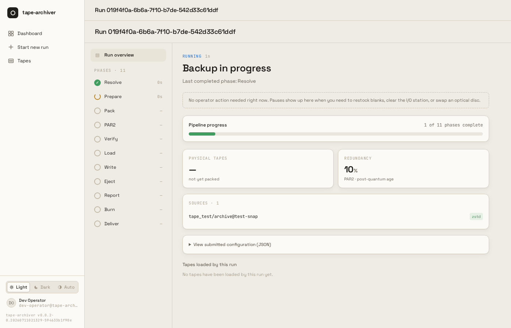 | 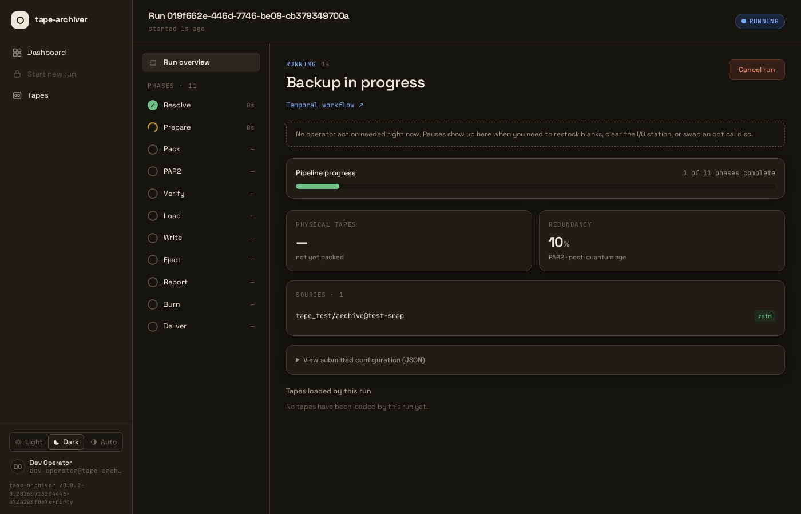 |
| 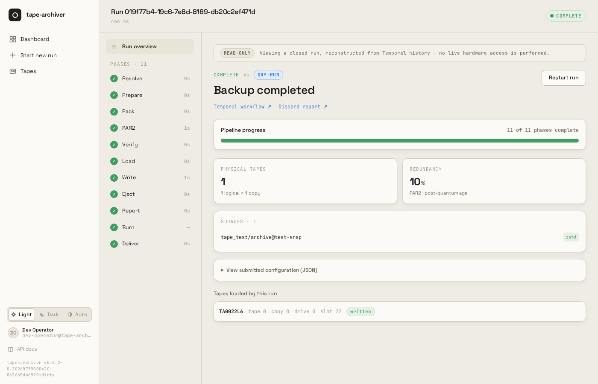 | 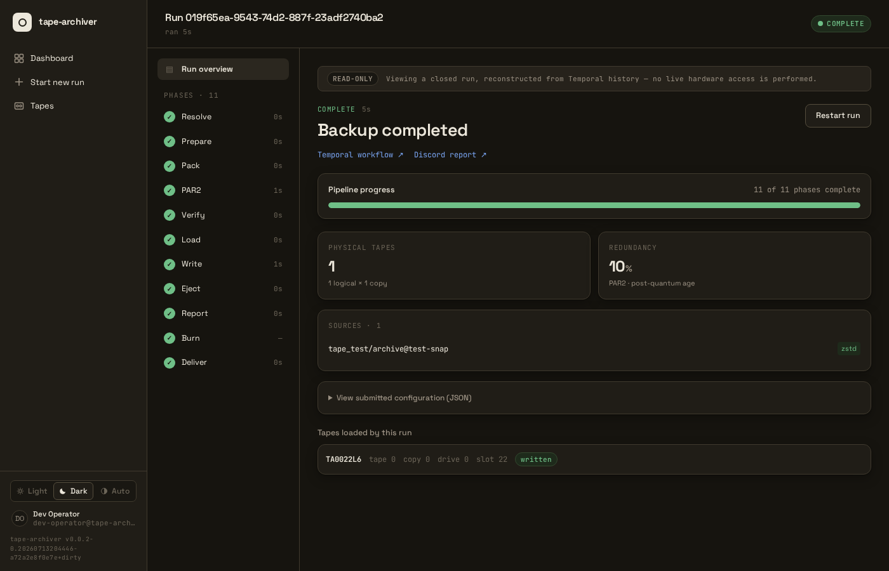 |
| 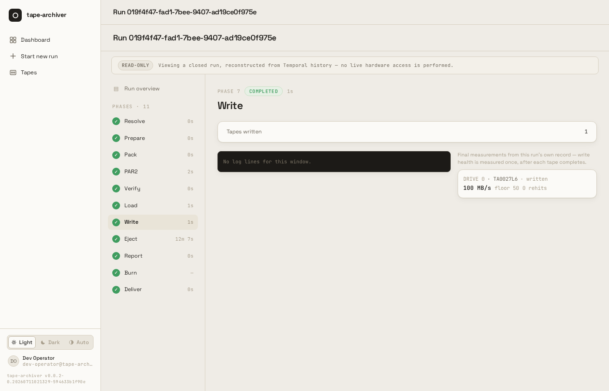 | 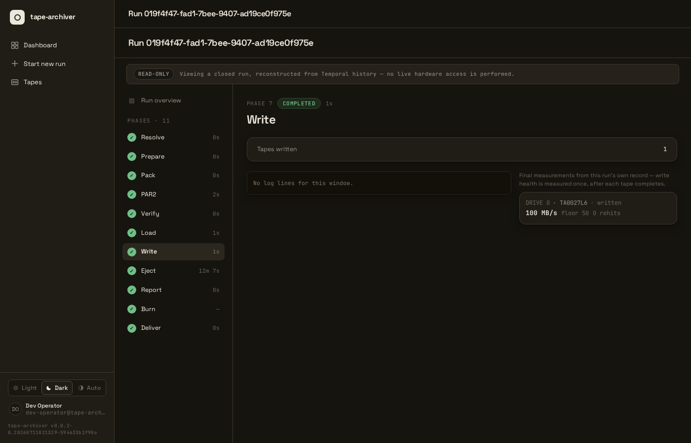 |

Reach a run's detail page either by submitting a run (which redirects there), or by
clicking through from the [dashboard's runs table](#dashboard).

Once a run reaches a terminal status (completed, failed, terminated, or canceled), its
detail page renders read-only — a "READ-ONLY" banner marks it, no VictoriaMetrics/live
hardware polling happens, and the Write phase's drive figures switch from live readings
to that run's own final recorded write-health per tape (`GET /api/runs/{runID}/tapes`).
This works the same whether the run just finished while you were watching it, or you
navigated straight to an already-closed run's page.

Two things can go wrong reaching a run's detail:

- **The run ID doesn't exist at all** — Temporal has no record of it (a mistyped ID, or
  it was never submitted). The page says so plainly, distinct from the next case.
- **The run existed, but its phase-by-phase history has aged out of Temporal's retention
  window.** Temporal still remembers *that* the run happened (so this is distinguishable
  from "doesn't exist"), but its phases and contents can no longer be reconstructed — the
  page explains this rather than showing broken or empty phase data. If VictoriaLogs or
  VictoriaMetrics (rather than Temporal itself) is what's unavailable, only the affected
  panel (the log view or the drive-metrics view) shows its own "unavailable" state; the
  rest of the page — phase rail, facts, pause controls — keeps working normally.

## Acting on an operator-in-the-loop pause

Some backup phases pause and wait for a human before continuing (SPEC §4.3, §10): the
Eject phase when the import/export station fills, the tape write path on a load or write
failure, and the Burn phase on a burn/verify failure or a between-set disc swap. A run's
detail page surfaces an active pause the moment it starts (via the same live stream
described above), on the **Run overview** view, with enough context to act on it — the
failing phase, affected tape barcodes, which storage slots to reload with fresh blanks,
or which burner devices need a fresh disc, depending on the pause kind (`PauseActions.tsx`
— unchanged by the run-detail redesign, just re-homed into the new **Run overview** view).
The screenshots below are from a real Eject pause (a `make web-dev` dev stack's mhvtl
import/export station genuinely filling up across several dry-runs sharing one session
— issue #281's live-verification pass hit this organically, and used it rather than
staging one artificially):

| Light | Dark |
| --- | --- |
| 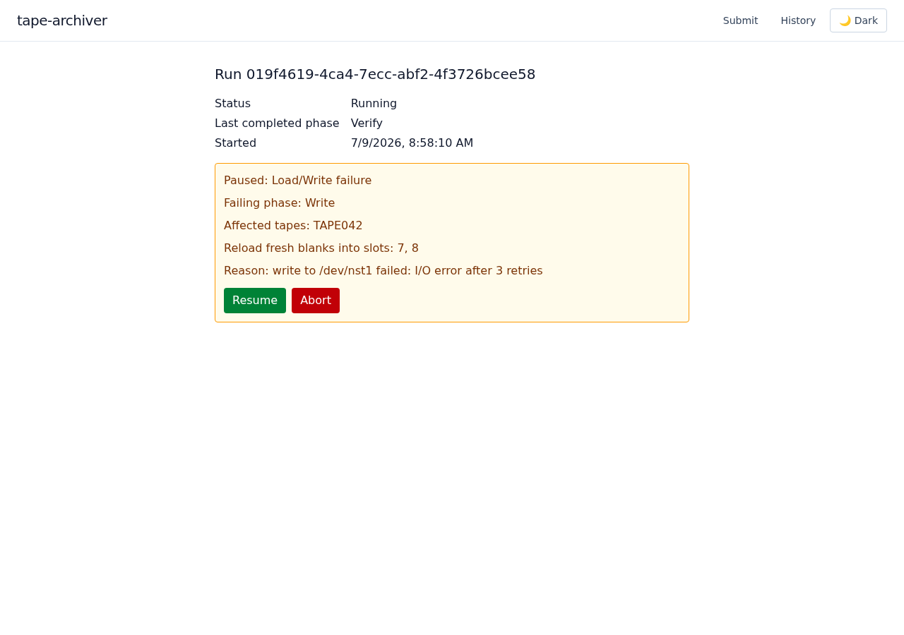 | 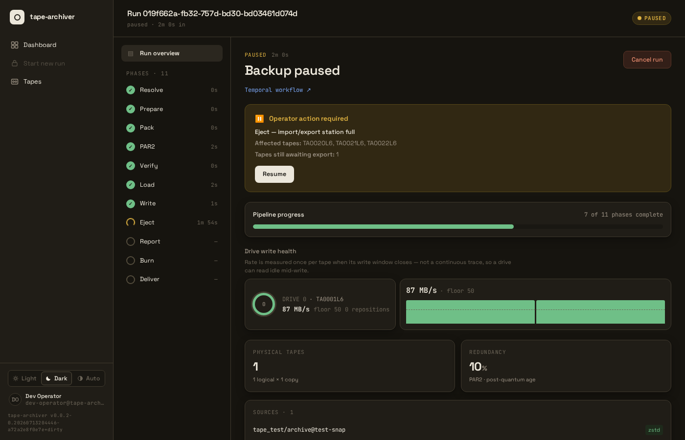 |

**Resume** and **Abort** send the same `OperatorResumeSignal` / `OperatorAbortSignal`
that [`tapectl resume`](tapectl.md#tapectl-resume) and
[`tapectl abort`](tapectl.md#tapectl-abort) do — acting from the browser has exactly the
same effect as acting from the CLI:

- **Resume** acts immediately on click — it simply continues a run the operator has
  already decided to keep. It only makes sense once the blocking condition is actually
  cleared (the I/O station emptied and closed, fresh blanks loaded, a fresh disc inserted)
  — sending it before that just re-hits the same failure.
- **Abort** ends the run in a defined, reported state with no further tapes written or
  discs burned. Because that is consequential and not undoable, it asks for confirmation
  first in the same full-screen modal dialog (over a dimmed, blurred backdrop) the
  **Cancel run** control uses — resolved with **Abort run** or **Keep paused**. It is not
  offered for an Eject pause: every tape is already safely written by the time an Eject
  pause happens, so there is nothing left for an abort to protect against — the same rule
  `tapectl abort` follows. Attempting it anyway (e.g. via a direct API call) is rejected by
  the server the same way `tapectl abort` is.

If the pause status itself can't be determined right now (e.g. no worker is currently
polling the workflow), the page shows a clear "pause status unavailable" warning rather
than silently looking like a healthy, unpaused run — check `tapectl status` or retry
shortly in that case.

### Cancelling a run

A still-running run's **Run overview** carries a **Cancel run** button in its status hero
(and, if the phase timeline can't be loaded, in the degraded fallback view). Unlike
**Resume** / **Abort**, which are pause signals that only apply once the run is already
paused for the operator, **Cancel run** stops *any* in-progress run — paused or not — and
so is the general "stop this run now" control. It is offered only while the run is still
in progress; a run that has already closed shows no button.

Cancel requests graceful Temporal cancellation (`POST /api/runs/{runID}/cancel` →
`CancelWorkflow`), never a forceful terminate: the workflow's own deferred cleanup runs on
a disconnected context, so a cancelled run tears down its LTFS mounts, releases its ZFS
hold, posts the same failure/cancellation alert to the Discord failure webhook as any
other run end (SPEC §10), and closes in the `Canceled` state rather than being killed
mid-flight and left with wedged mounts. Because cancelling is consequential and not
undoable, it asks for confirmation first in a modal dialog — a centered box over a dimmed,
blurred backdrop that must be resolved with **Yes, cancel run** or **Keep running** (or
dismissed with Escape) — and needs no manual refresh: the resulting `Canceled` status
arrives over the page's live stream within one poll interval.
The server confirms the run is still running before requesting cancellation, so a request
that races the run closing on its own is reported cleanly rather than acted on twice.

### Restarting a run

Once a run has closed, the **Cancel run** control in the status hero is replaced — in the
same slot — by **Restart run**. It is the "run this again" shortcut: it opens the **Start
new run** page preloaded with that run's own submitted configuration (`/submit?from=<runId>`
→ `GET /api/runs/{runID}/config`), so the sources, tape/redundancy settings, recipients,
copy count, and the rest come back without retyping. Because backup runs are a singleton
(SPEC §4.2), the button is disabled while another run is in progress — the same restriction
the sidebar's **Start new run** applies — with a short note explaining why.

Restart lands on the **Build** step (Form mode) rather than jumping straight to **Review**
for one reason: the run-config endpoint redacts the age identity — a private key — before
returning a config (it also redacts the Discord webhook, but that is sourced from the
deployment's config, so it needs no re-entry). The identity is required, and resubmitting a
redacted or wrong one would break the archive's recoverability (the project's first
principle), so the preload blanks it and a notice asks the operator to re-enter it before
continuing to **Review** and submitting. Everything else is filled in; a config carrying an
advanced field the guided form has no control for (see the config page's mode-switch notes)
is named in the same notice, exactly as a JSON → Form switch reports it.

## Browsing tapes

The **Tapes** page (`/tapes`) lists every physical tape written by a run still inside
Temporal's history window — barcode, a link to the run that wrote it, its logical-tape
and copy index, its write outcome (loaded/written/failed, with a failed tape's reason
shown under the badge, and an **overwrote non-blank** flag when the run reused a
non-blank tape via `library.allowNonBlankTapes` — SPEC §4.3 step 6), and a
summary of its measured write health (throughput, whether
it stayed above the speed-matching floor, the reposition count — or an explicit note
when repositions could not be measured — and any TapeAlert flags — SPEC §14). Each of
those warning signals gets its own badge, and any combination can appear together.
Each row is reconstructed on the fly from that run's own
Temporal execution history via `GET /api/tapes` (correlating the Load phase's per-tape
barcodes with the Write phase's format/write/finalize/measure activities), the same way
a single run's [`GET /api/runs/{runID}/tapes`](tapectl.md) backs the run detail page's
drive write-health panel.

The archiver keeps **no persistent tape catalog** (SPEC §4.2): this page does not read
live status from the tape changer, and there is no permanent inventory anywhere in the
system. A banner at the top of the page states this explicitly. Once a run ages out of
Temporal's visibility retention window, the tapes it wrote drop off this list — its PDF
report (delivered to Discord, see [`docs/report.md`](report.md)) remains the permanent
record of what it wrote.

By default the page reconstructs tapes from the 50 most recent runs (the API's own
default) — there is no "show more"/limit control on the page itself, matching the design
reference for this page. If a run's history cannot be reconstructed (for example, one
whose Temporal history has partially aged out), that run is reported by name in a
separate warning notice above the table rather than failing the whole page — every other
run's tapes still list normally.

If no run still within Temporal's retention has written a tape yet, the page shows an
empty-state message instead of an empty table.

| Light | Dark |
| --- | --- |
| 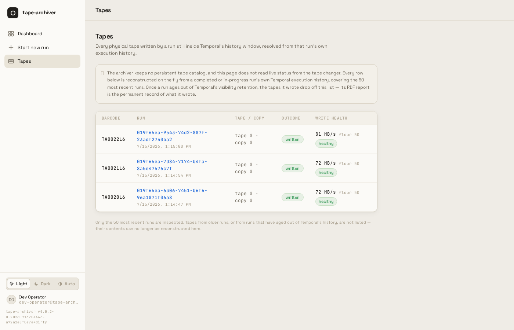 | 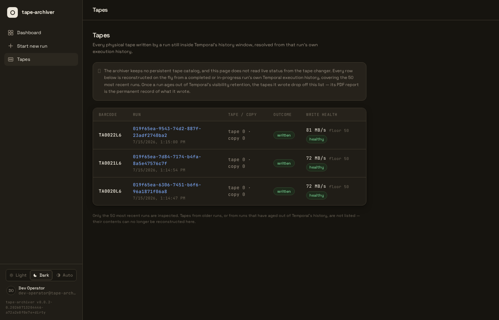 |

## API documentation (OpenAPI / Swagger)

The same JSON API the SPA calls is described by a machine-readable OpenAPI 3.1
document, served by `cmd/web` alongside the API itself:

- `GET /api/openapi.json` and `GET /api/openapi.yaml` — the OpenAPI 3.1 document
  (a downgraded OpenAPI 3.0 variant is also served at `GET /api/openapi-3.0.json`
  / `.yaml` for tooling that cannot yet read 3.1). Point any OpenAPI-aware tool —
  an editor, a client generator, `curl` — at these to inspect or consume the API.
- `GET /api/docs` — a browsable, interactive reference (Stoplight Elements) for
  reading the endpoints and trying them from the browser. Its "try it" requests
  reuse your logged-in session cookie, so they run as you. The signed-in app
  shell links to this page from an "API docs" link in the sidebar footer (it
  opens in a new tab).

Like every other `/api/*` route, all three are gated behind an OIDC session — you
must be signed in to reach them. The interactive `/api/docs` page loads its
renderer (JS/CSS) from a public CDN (`unpkg.com`), so that page needs outbound
internet from the browser; the `/api/openapi.json` / `.yaml` documents themselves
are served entirely by `cmd/web` and need no network.

The document is generated from the Go request/response types the handlers already
use (via [`huma`](https://github.com/danielgtaylor/huma)), as a description-only
layer that does not change how any endpoint is served — so the documented response
shapes and the `{"error": "..."}` error envelope match what the API actually
returns. It is built in memory at startup; there is no committed spec file to keep
in sync.

## Local development

Everything above assumes a real deployment (a real Temporal cluster, a real identity
provider, a real tape library). For iterating on the UI itself, `make web-dev` brings up
a complete local stand-in with one command: dev Temporal, `mhvtl`, and an ephemeral
ZFS test pool (reusing the existing `temporal-up`/`mhvtl-up`/`zpool-up` targets and
scripts unchanged), a local VictoriaLogs + VictoriaMetrics stack fed by the dev workers'
own logs/metrics, a local OIDC provider, a local fake Discord webhook receiver, real
control and data workers, and `cmd/web`
itself — with a few sample dry-run backups submitted automatically so the
[dashboard](#dashboard)'s runs table has something in it right away (the startup banner
and `cmd/webdevseed`'s own comments still say "History" — its previous, now-folded-in
name; not updated here, out of scope for this change).

```console
$ make web-dev
...
==============================================================================
 tape-archiver web UI dev stack is up.

   URL:      http://127.0.0.1:8080
   Log in with:
     subject: dev-operator
     email:   dev-operator@tape-archiver.local
     name:    Dev Operator

   The local OIDC provider has no interactive login form (issue #265's
   documented tradeoff for zero new Go/Docker dependencies) — opening the URL
   and following the redirect signs you in as the user above automatically;
   there is nothing to type.

   Sample dry-run backups are being submitted in the background and will
   appear in History over the next few minutes (tail the printed log path
   to watch progress).

   VictoriaLogs:    http://127.0.0.1:9428
   VictoriaMetrics: http://127.0.0.1:8428
   (query these directly, e.g. for LogsQL/PromQL exploration beyond what the
   run detail page's log and drive-metrics panels already show.)

   Ctrl+C (or SIGTERM) stops the whole dev stack: cmd/web shuts down first,
   then the full 'make web-dev-down' teardown runs automatically —
   Temporal/mhvtl/zpool, VictoriaLogs/VictoriaMetrics, the OIDC provider, and
   the workers all come down, so the next 'make web-dev' always starts from a
   clean slate. Run 'make web-dev-down' yourself only after a crash/SIGKILL,
   which cannot be trapped.
==============================================================================
```

Open the printed URL. Since backup runs are a Temporal singleton (SPEC §4.2), the 2-3
sample dry-runs seed sequentially in the background rather than blocking startup — each
is a real run against `mhvtl` and the ZFS test pool (staging, tar, age encryption, PAR2,
LTFS write, eject, report), so the dashboard's runs table fills in progressively over
the next few minutes rather than all at once.

By default one of the seeded runs is a deliberately **failed** run (set
`WEBDEVSEED_FAIL_COUNT`, default `1`, to `0` to disable, or higher for more) so the
failed-run surfaces have something to show locally too — the history table's failed row,
the run detail page's error console and failure hero, and the SPEC §11 failure-alert path
to the fake Discord webhook. A failed seed run runs the full pipeline, then delivers its
report to the fake receiver's reject endpoint, which rejects the upload with a permanent
`403`; the `Deliver` phase treats that as a non-retryable rejection and the run fails
there. (Delivery is the failure lever because its retry policy is bounded — an earlier
phase like `Resolve` retries under Temporal's server-default unlimited policy and would
leave the run stuck `Running` rather than failing.) The failed runs are seeded first, so
the most-recent run — the dashboard's idle "last run" summary — stays a successful one;
the failed run is one click away in the history table.

Interrupting `make web-dev` (Ctrl+C, which sends `SIGINT` to the whole foreground
process group, or `SIGTERM` sent the same way — e.g. by a supervisor) tears the entire
stack back down: `cmd/web` shuts down gracefully first, and once it has actually
exited, the full `web-dev-down` teardown runs — the OIDC provider, both workers, and
any in-flight seeder are stopped, the state dir is removed, and Temporal/`mhvtl`/the
ZFS pool/VictoriaLogs/VictoriaMetrics come down via their own `*-down` targets. This is a
deliberate change from the original fast-restart design (issue #265): Temporal and
`mhvtl` state have to move in lockstep (stale `mhvtl` slot state from an interrupted
seeding pass, for example, breaks the next run's `Load` step), and nothing enforces that
if only part of the stack comes down. So every `make web-dev` now starts from a clean
slate — dev Temporal, blank virtual tapes, a freshly recreated pool, and empty
VictoriaLogs/VictoriaMetrics volumes — at the cost of a slower restart than the
few-seconds turnaround the original design aimed for.

`make web-dev-down` remains available (and idempotent) as its own target — it's what
`make web-dev` itself runs on interrupt, and it's also the remedy after a crash or
`SIGKILL`, neither of which can be trapped and cleaned up automatically.

**VictoriaLogs + VictoriaMetrics (issue #280).** `docker-compose.web-dev.yml` — a
separate compose file from the root `docker-compose.yml` that `temporal-up`/
`temporal-down` back, so these containers only ever run for `make web-dev`, never for
`test-integration`/`test-e2e` — brings up three containers, all on `network_mode: host`
so they can reach the dev workers' loopback-bound ports directly:

- **`victorialogs`** (VictoriaLogs) ingests the dev workers' structured `slog` JSON
  stdout. `scripts/web-dev-up.sh` redirects each worker's combined stdout/stderr into
  `$WEB_DEV_STATE_DIR/logs/<name>.log`; a **`vector`** container tails those files,
  parses each line as JSON, and ships it into VictoriaLogs' JSON stream API
  (`/insert/jsonline`), preserving every field the worker logged — including the
  `WorkflowID`/`RunID` tags, which is what makes a run's logs matchable by LogsQL.
  Those tags land on **every** line an activity emits, not just the Temporal
  SDK's context-logger (`workflow.GetLogger`/`activity.GetLogger`) lines: the
  worker installs an activity interceptor (`cmd/worker/logtags.go`) that seeds the
  activity context with the run's `WorkflowID`/`RunID`, and `pkg/logging`'s handler
  lifts them onto every record logged with that context. Without this, only the
  handful of SDK error-path log lines carried `RunID`, so a successful run's log
  panel came up empty (#303).
- **`victoriametrics`** (VictoriaMetrics) scrapes both dev workers' Prometheus
  `/metrics` endpoints directly (`scripts/web-dev-vm-scrape.yml`: static targets at the
  control/data workers' fixed dev-stack `METRICS_ADDR` ports, 19090/19091), including
  the write-health gauges `workflows/backup/writehealth.go` registers.
- `cmd/web` is started with `VICTORIALOGS_URL`, `VICTORIALOGS_STREAM_FILTER`, and
  `VICTORIAMETRICS_URL` already pointed at these containers (`http://127.0.0.1:9428`,
  `*`, and `http://127.0.0.1:8428` respectively). `VICTORIAMETRICS_URL` backs the live
  drive metrics endpoints (issue #275 — see
  [Live drive metrics (VictoriaMetrics)](configuration.md#live-drive-metrics-victoriametrics)),
  wired into a run's Write phase view (see [Monitoring a run
  live](#monitoring-a-run-live)). `VICTORIALOGS_URL`/`VICTORIALOGS_STREAM_FILTER`
  back the phase-scoped log panels on that same page
  ([`GET /api/runs/{runID}/logs`](configuration.md#get-apirunsrunidlogs-log-panel-issue-274),
  issue #274); query VictoriaLogs directly (`curl` against the URL the startup
  banner prints, e.g. `.../select/logsql/query`) for anything beyond what those
  panels show.

Both containers, the log shipper, and their volumes come down as part of the same
`web-dev-down` teardown described above (`make web-dev-observability-up`/
`web-dev-observability-down` are also available standalone for manual poking).

**Local OIDC provider — how it works and its one real tradeoff.** `cmd/web` refuses to
start without a real, reachable OIDC provider (see
[OIDC authentication](configuration.md#oidc-authentication-cmdweb)), so `make web-dev`
starts one: a small dev-only binary (`cmd/webdevoidc`) wrapping the same real, in-process,
standards-compliant OpenID Connect implementation (`internal/devoidc`) already exercised
end to end by `pkg/webauth`'s own tests — real discovery, JWKS, and a real
authorize/token exchange with PKCE, not a mock. This was chosen over running a real
identity provider (e.g. [Dex](https://dexidp.io/)) in Docker specifically to avoid a new
external dependency and image pull; the tradeoff, called out explicitly since it differs
from a real deployment, is that this provider's `/authorize` endpoint has **no
interactive login form** — it immediately authenticates the fixed test user
`make web-dev` prints and redirects back. Opening the URL and reaching the app *is*
"logging in" here; there is nothing to type. This provider is dev-tooling only — it is
never built into a shipped image and is not meant to be reachable from anywhere but your
own machine.

**Fake Discord webhook receiver — so the report deep-link works locally (issue #313).**
A run's success delivery posts the PDF report to a Discord webhook, and the run overview's
**Discord report ↗** link is reconstructed from that posted message's identity (see
[Reading a run](#reading-a-run)). With no real Discord webhook — and a placeholder
`discord.com` URL that would reject the upload — neither would happen locally, so
`make web-dev` starts a small dev-only binary (`cmd/webdevdiscord`) that stands in for
Discord's webhook API: it implements exactly the three calls `pkg/webhook` makes (the
`?wait=true` multipart report upload, the no-wait JSON alert, and the webhook-object
`GET`), returning syntactically-valid but obviously-fake snowflake IDs. `cmd/web`'s
`DELIVERY_WEBHOOK_URL` and the seeder both point at it, so every seeded run delivers its
report there and the overview's **Discord report ↗** link renders — a well-formed
`https://discord.com/channels/{guild}/{channel}/{message}` URL that will *not* resolve on
real Discord (the IDs are dev fakes), but demonstrates the feature end to end. Like the
OIDC provider, it is dev-tooling only and comes down with the rest of the stack.

**Deploy-owned config the dev stack pre-fills.** So the guided config form and run
overview exercise the deploy-config surfaces (not just the run data), `make web-dev` also
sets, on `cmd/web`:

- `TEMPORAL_UI_URL=http://127.0.0.1:8233` — the dev Temporal UI `make temporal-up`
  already serves — so a run overview's **Temporal workflow ↗** deep-link resolves.
- `LIBRARY_CHANGER`/`LIBRARY_DRIVES` (the `mhvtl` nodes) and `LIBRARY_SLOT_COUNT=47`
  (the dev library's storage-slot count), so Form mode renders a real changer/drive
  summary and a 47-slot blank-slot grid.
- `LIBRARY_CLEANING_SLOTS`/`LIBRARY_IO_STATION_SLOTS` — illustrative high slot numbers
  (away from the seeder's slot pool), purely so the grid picker visibly renders
  non-selectable cleaning / I/O-station cells locally. The `mhvtl` library's three MAPs
  are a separate address space that does not map into the `1..47` grid, so these are
  dev-demonstration values rather than the library's true I/O addresses.

Seed configs deliberately set `library.allowNonBlankTapes` on a small, fixed pool of
`mhvtl` storage slots, so repeat `make web-dev` invocations can keep reusing them
indefinitely without needing to track which slots are still blank — these are disposable
dev archives, not real backups, so reclaiming them the same way an operator deliberately
would (see [`docs/configuration.md`](configuration.md)'s `library.allowNonBlankTapes`) is
the simplest correct choice here.

`make web-dev` is dev tooling only: it is not part of `make test-e2e` (which already
covers the real, automated, torn-down-after-itself verification path) and is not meant to
run in CI.
