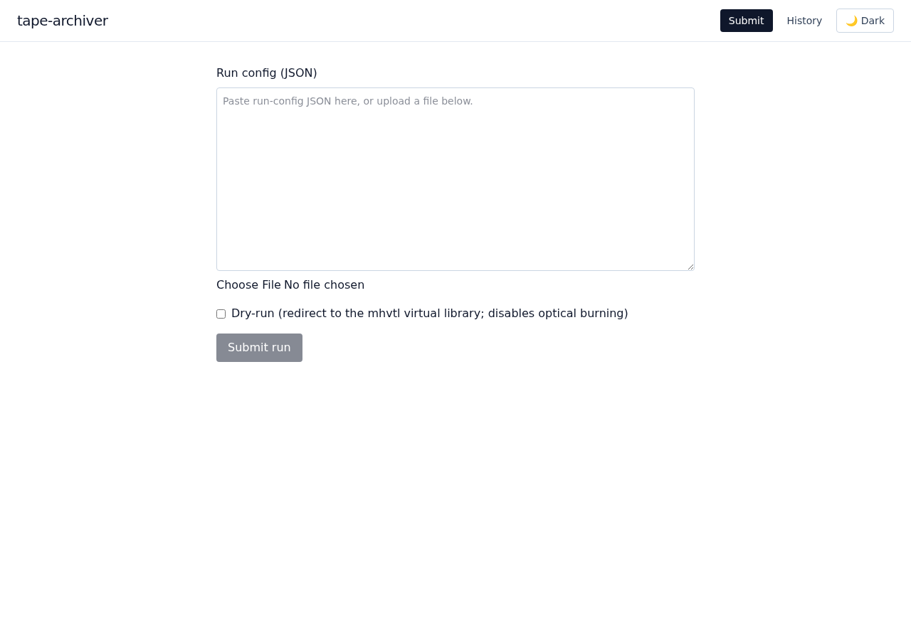
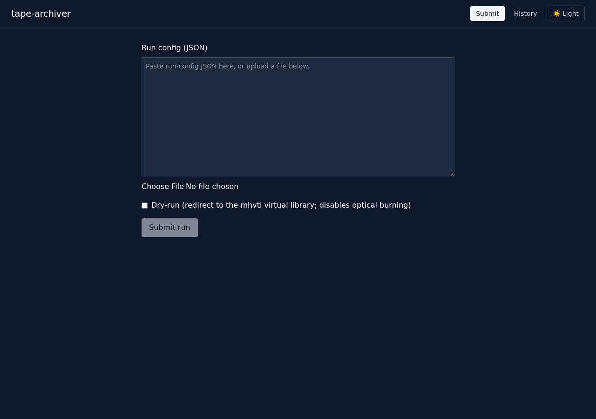
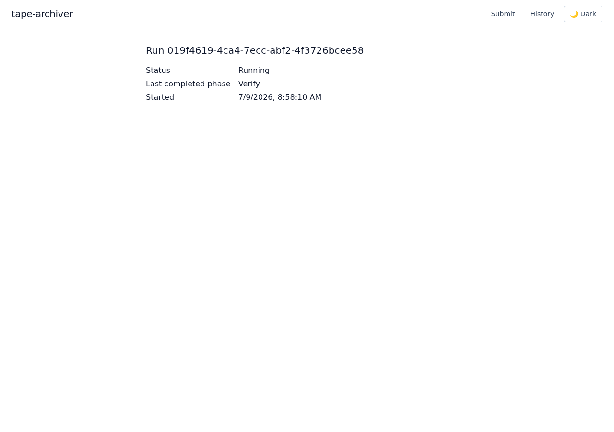
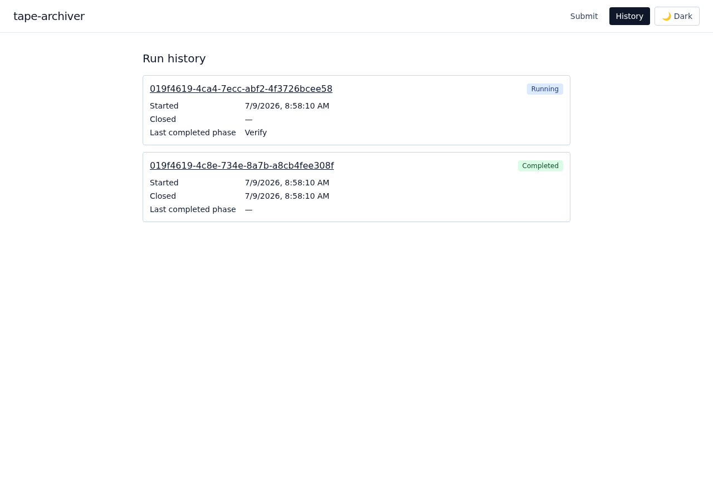
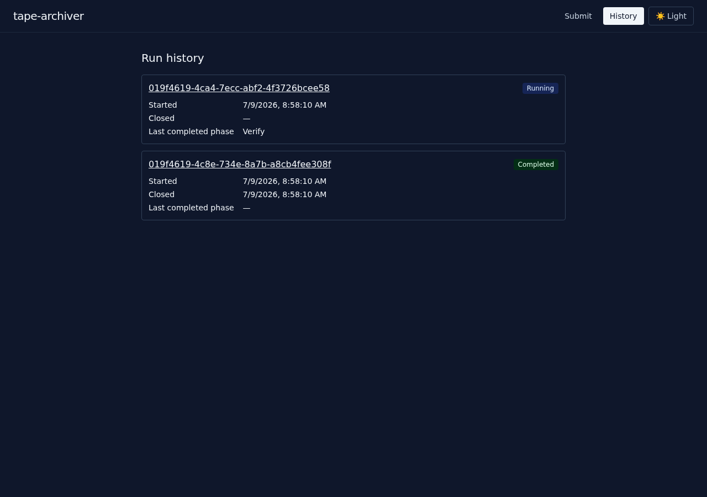

# Web UI

The web UI (`cmd/web`) is a browser-based alternative to `tapectl` for day-to-day
operation: submitting backup runs (including dry-runs), watching a run progress live,
acting on an operator-in-the-loop pause, and browsing run history — all from a browser,
with no local `tapectl` install or Temporal CLI access required. It talks only to the
Temporal frontend and the configured OIDC identity provider; it never touches tape
hardware or bulk data directly (SPEC §2, §4.2 — there is no UI-owned state, only Temporal
visibility and the backup workflow's own queries).

This doc covers day-to-day *use* of the UI. For deploying it, see
[`docs/web-image.md`](web-image.md) (the OCI image) and
[`docs/web-helm.md`](web-helm.md) (the Helm chart); for the full set of environment
variables and the OIDC login-flow internals, see
[Web UI environment variables](configuration.md#web-ui-environment-variables-cmdweb) and
[OIDC authentication](configuration.md#oidc-authentication-cmdweb) in
`docs/configuration.md`. For the design rationale behind the UI (why it exists, its
architecture, and the delivery plan for the epic that built it), see
[`docs/web-ui-design.md`](web-ui-design.md) — that is a design doc for implementers and
reviewers, not this operator guide.

Everything the UI does, `tapectl` can also do from the command line
([`docs/tapectl.md`](tapectl.md)) — the two share the same submit/dry-run path
(`pkg/runsubmit`) and the same resume/abort signals, so they can never diverge on what an
action means. Use whichever is more convenient; there is nothing the UI does that the
CLI cannot also do, and vice versa.

## Reaching the UI

Open the URL your deployment's Ingress (or `Service`, for a port-forward/internal-only
setup) exposes for the `tape-archiver-web` chart release — see
[`docs/web-helm.md`](web-helm.md) for how that's configured. Every page and every
`/api/*` route requires a signed-in session; visiting any URL while unauthenticated
redirects to the configured OIDC identity provider's login page, then back into the UI
once you sign in. There is no separate "public" view.

The app shell — the header with the `tape-archiver` title, **Submit** / **History**
navigation, and a light/dark toggle — is present on every page and reachable from
anywhere in the UI:

| Light | Dark |
| --- | --- |
|  |  |

The toggle switches between light and dark immediately and remembers your choice
(stored in the browser, per-browser — not an account-wide setting) across visits; until
you touch it, the UI follows your OS/browser's light/dark preference automatically.

## Submitting a run

The **Submit** page (the UI's home page, `/`) takes a run-config JSON document — the
same document `tapectl run --config <file>` takes (see
[`docs/configuration.md`](configuration.md) for the full config reference). Either paste
it directly into the text area, or use the file picker to load it from disk (the picker
reads the file client-side and fills the text area with its contents — nothing is
uploaded until you actually submit).

Check **Dry-run** to redirect the submission to the `mhvtl` virtual library and disable
optical burning, exactly like `tapectl run --dry-run` — see
[`--dry-run`](tapectl.md#tapectl-run) for exactly what that overrides and why (in short:
it swaps the config's changer/drive device paths for the `mhvtl` equivalents and strips
the optical-burn section, so a dry-run never touches real tape hardware or a real
burner). A dry-run submitted through the browser fails closed with a clear error if the
server itself isn't configured with `mhvtl` device paths — it never silently falls back
to real hardware.

Click **Submit run**. A malformed or invalid config is rejected immediately with the
validation error, and nothing is submitted. A valid submission starts the backup
workflow and shows its run ID and workflow ID, with a **View run** link straight into
that run's live detail page. Since backup runs are a singleton (SPEC §4.2 — only one can
be active at a time), submitting while a run is already in progress is rejected with a
conflict error rather than queuing or replacing it.

## Monitoring a run live

A run's detail page (`/runs/{runID}`) shows its execution status, last completed phase,
and start/close time, updating in place as the run progresses — no manual reload. This
is backed by a live server-sent event stream, so the moment the workflow's status or
phase changes (or a pause starts or clears), the page reflects it within a couple of
seconds.



If the underlying connection drops, the page shows a "connection lost" notice and keeps
retrying automatically; once the run reaches a terminal status (completed, failed,
terminated, or canceled) the page shows a "run finished" notice and stops polling — there
is nothing further to watch.

Reach a run's detail page either via the **View run** link right after submitting, or by
clicking through from the [history list](#browsing-run-history).

## Acting on an operator-in-the-loop pause

Some backup phases pause and wait for a human before continuing (SPEC §4.3, §10): the
Eject phase when the import/export station fills, the tape write path on a load or write
failure, and the Burn phase on a burn/verify failure or a between-set disc swap. A run's
detail page surfaces an active pause the moment it starts (via the same live stream
described above), with enough context to act on it — the failing phase, affected tape
barcodes, which storage slots to reload with fresh blanks, or which burner devices need
a fresh disc, depending on the pause kind:

| Light | Dark |
| --- | --- |
|  |  |

**Resume** and **Abort** send the same `OperatorResumeSignal` / `OperatorAbortSignal`
that [`tapectl resume`](tapectl.md#tapectl-resume) and
[`tapectl abort`](tapectl.md#tapectl-abort) do — acting from the browser has exactly the
same effect as acting from the CLI. Both actions ask for confirmation first, since they
are consequential and, once acted on, not undoable:

- **Resume** only makes sense once the blocking condition is actually cleared (the I/O
  station emptied and closed, fresh blanks loaded, a fresh disc inserted) — sending it
  before that just re-hits the same failure.
- **Abort** ends the run in a defined, reported state with no further tapes written or
  discs burned. It is not offered for an Eject pause: every tape is already safely
  written by the time an Eject pause happens, so there is nothing left for an abort to
  protect against — the same rule `tapectl abort` follows.

If the pause status itself can't be determined right now (e.g. no worker is currently
polling the workflow), the page shows a clear "pause status unavailable" warning rather
than silently looking like a healthy, unpaused run — check `tapectl status` or retry
shortly in that case.

## Browsing run history

The **History** page (`/history`) lists every execution of the singleton backup
workflow within Temporal's visibility retention window — the same executions
`temporal workflow list` (or the Temporal Web UI) would show against workflow ID
`backup`, presented as a list with each run's status, start/close time, and (for the
currently running entry, if any) its last completed phase. `tapectl status` only reports
the *current* run (SPEC §4.2's singleton model) and has no history equivalent — this
page is the only place status/timing for *past* runs is surfaced without going to
Temporal directly:

| Light | Dark |
| --- | --- |
|  |  |

Click a run's ID to open its [detail page](#monitoring-a-run-live). A closed run's "last
completed phase" is not shown here (only a live workflow query can answer that, and a
closed run has no worker left polling it) — its final status and timing tell you how it
ended; a run's PDF report (delivered to Discord on completion, see
[`docs/report.md`](report.md)) has the full phase-by-phase detail if you need it.

History has no pagination and no filtering — it lists everything Temporal's visibility
still retains, newest first. Given backup runs are singleton and serial (SPEC §4.2),
this stays well within a single page for any realistic retention window.

## Local development

Everything above assumes a real deployment (a real Temporal cluster, a real identity
provider, a real tape library). For iterating on the UI itself, `make web-dev` brings up
a complete local stand-in with a couple of clicks: dev Temporal, `mhvtl`, and an ephemeral
ZFS test pool (reusing the existing `temporal-up`/`mhvtl-up`/`zpool-up` targets and
scripts unchanged), a local OIDC provider, real control and data workers, and `cmd/web`
itself — with a few sample dry-run backups submitted automatically so History has
something in it right away.

```console
$ make web-dev
...
==============================================================================
 tape-archiver web UI dev stack is up.

   URL:      http://127.0.0.1:8080
   Log in with:
     subject: dev-operator
     email:   dev-operator@tape-archiver.local
     name:    Dev Operator

   The local OIDC provider has no interactive login form (issue #265's
   documented tradeoff for zero new Go/Docker dependencies) — opening the URL
   and following the redirect signs you in as the user above automatically;
   there is nothing to type.

   Sample dry-run backups are being submitted in the background and will
   appear in History over the next few minutes (tail the printed log path
   to watch progress).

   Ctrl+C (or SIGTERM) stops the whole dev stack: cmd/web shuts down first,
   then the full 'make web-dev-down' teardown runs automatically —
   Temporal/mhvtl/zpool, the OIDC provider, and the workers all come down, so
   the next 'make web-dev' always starts from a clean slate. Run
   'make web-dev-down' yourself only after a crash/SIGKILL, which cannot be
   trapped.
==============================================================================
```

Open the printed URL. Since backup runs are a Temporal singleton (SPEC §4.2), the 2-3
sample dry-runs seed sequentially in the background rather than blocking startup — each
is a real run against `mhvtl` and the ZFS test pool (staging, tar, age encryption, PAR2,
LTFS write, eject, report), so History fills in progressively over the next few minutes
rather than all at once.

Interrupting `make web-dev` (Ctrl+C, which sends `SIGINT` to the whole foreground
process group, or `SIGTERM` sent the same way — e.g. by a supervisor) tears the entire
stack back down: `cmd/web` shuts down gracefully first, and once it has actually
exited, the full `web-dev-down` teardown runs — the OIDC provider, both workers, and
any in-flight seeder are stopped, the state dir is removed, and Temporal/`mhvtl`/the
ZFS pool come down via their own `*-down` targets. This is a deliberate change from the
original fast-restart design (issue #265): Temporal and `mhvtl` state have to move in
lockstep (stale `mhvtl` slot state from an interrupted seeding pass, for example, breaks
the next run's `Load` step), and nothing enforces that if only part of the stack comes
down. So every `make web-dev` now starts from a clean slate — dev Temporal, blank
virtual tapes, and a freshly recreated pool — at the cost of a slower restart than the
few-seconds turnaround the original design aimed for.

`make web-dev-down` remains available (and idempotent) as its own target — it's what
`make web-dev` itself runs on interrupt, and it's also the remedy after a crash or
`SIGKILL`, neither of which can be trapped and cleaned up automatically.

**Local OIDC provider — how it works and its one real tradeoff.** `cmd/web` refuses to
start without a real, reachable OIDC provider (see
[OIDC authentication](configuration.md#oidc-authentication-cmdweb)), so `make web-dev`
starts one: a small dev-only binary (`cmd/webdevoidc`) wrapping the same real, in-process,
standards-compliant OpenID Connect implementation (`internal/testutil`) already exercised
end to end by `pkg/webauth`'s own tests — real discovery, JWKS, and a real
authorize/token exchange with PKCE, not a mock. This was chosen over running a real
identity provider (e.g. [Dex](https://dexidp.io/)) in Docker specifically to avoid a new
external dependency and image pull; the tradeoff, called out explicitly since it differs
from a real deployment, is that this provider's `/authorize` endpoint has **no
interactive login form** — it immediately authenticates the fixed test user
`make web-dev` prints and redirects back. Opening the URL and reaching the app *is*
"logging in" here; there is nothing to type. This provider is dev-tooling only — it is
never built into a shipped image and is not meant to be reachable from anywhere but your
own machine.

Seed configs deliberately set `library.allowNonBlankTapes` on a small, fixed pool of
`mhvtl` storage slots, so repeat `make web-dev` invocations can keep reusing them
indefinitely without needing to track which slots are still blank — these are disposable
dev archives, not real backups, so reclaiming them the same way an operator deliberately
would (see [`docs/configuration.md`](configuration.md)'s `library.allowNonBlankTapes`) is
the simplest correct choice here.

`make web-dev` is dev tooling only: it is not part of `make test-e2e` (which already
covers the real, automated, torn-down-after-itself verification path) and is not meant to
run in CI.
